## 信号传输与调制

## 第一个题型: source coding

## (1) What does source coding mean? Why is it necessary? Please explain briefly. What are its objectives/goals?

Source coding means transmission-suited (and least-effort) representation of the
message.

It aims to compress data rate by reducing redundancy for efficient transmission
and storage.

**(2) How imagine the Shannon-Weaver model? Where in his model is source coding
located?**

The Shannon-Weaver model is a mathematical theory that describes the process of
telecommunication. It involves three basic elements: an information source, a
transmitter (encoder), and a receiver (decoder), which communicate through a
channel affected by noise. The model visualizes the transmission of a message
from a source to a destination using various types of media.

Source coding, or encoding, is located in the transmitter element of the model.

## (3). What is the input to source coding, what is the output?

Input is the source signal; output is the compressed code.

## (4). Redundancy -- source coding fries to reduce it. Why? Explain briefly.

To reduce data rate for efficient transmission and storage.

## (5). What does receiver do for source decoding?

inverse source encoding, offers the destination a decoding scheme (比如 data
decompression)

## (6). 画Shannon-Weaver模型

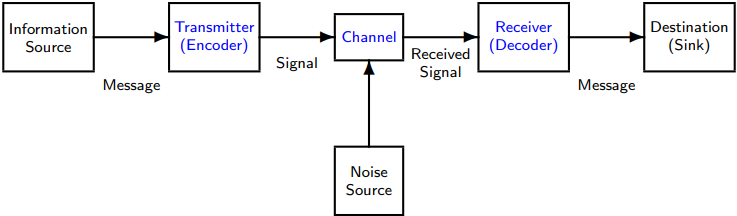

## 第二个题型: channel encoding

## (1) What does channel encoding mean? Why is it necessary? Please explain briefly. What are its objectives/goals?

Channel encoding refers to the process of adding redundancy to data signals
before transmission to protect against errors caused by channel noise. It is
necessary to improve the reliability of data transmission in noisy environments.
The objectives of channel encoding are to increase the bit error rate (BER) and
minimize signal distortion.

## (2). What is the input to channel encoding, what is the output?

Input to channel encoding is the source data signal, output is the encoded
signal with added redundancy.

## (3). Redundancy -- channel encoding fries to reduce it. Why? Explain briefly.

Redundancy is added to the data signal to enable the receiver to detect and
correct errors caused by channel noise. By reducing redundancy, channel coding
improves transmission efficiency without sacrificing the reliability of data
transmission.

## (4). What does receiver do for channel decoding?

inverse channel encoding, error detection or correction (比如 retransmission
request when indicated)

## 第三个题型: line encoding/modulation

## (1) What does line encoding/modulation mean? Why is it necessary? Please explain briefly. What are its objectives/goals?

Line encoding/modulation refers to the process of converting digital data into
analog signals suitable for transmission over a communication channel. It is
necessary to enable reliable and efficient communication over long distances.
The objectives of line encoding/modulation are to maximize signal quality and
minimize distortion during transmission.

## (2). What is the input to line encoding/modulation, what is the output?

Input to line encoding/modulation is digital data, output is analog signal.

## (3). Redundancy -- line encoding/modulation fries to reduce it. Why? Explain briefly.

By minimizing redundancy in the transmitted signal, line encoding/modulation
maximizes the efficiency of signal transmission over the channel. This is done
while still maintaining appropriate signal quality for reliable data
transmission.

## (4). What does receiver do for line decoding/demodulation?

Extraction of the information-bearing signal from the modulated carrier signal.
(比如filtering, echo cancelation)

## 第四个题型: modulation

## (1) What does modulation mean? Why is it necessary? Please explain briefly. What are its objectives/goals?

Modulation refers to the process of modifying a high-frequency carrier signal to
carry information by varying its amplitude, frequency, or phase. It is necessary
to enable communication over long distances and through different media. The
objectives of modulation are to maximize the data rate, minimize interference,
and improve signal quality.

## (2). What is the input to modulation, what is the output?

Input to modulation is the baseband signal carrying the information, output is
the modulated carrier signal.

## (3). Redundancy -- modulation fries to reduce it. Why? Explain briefly.

Redundancy is minimized in the modulated carrier signal to maximize the
efficiency of information transmission while avoiding interference from other
signals in the same frequency band. This is achieved by encoding the information
onto the carrier signal in such a way as to occupy the minimum required
bandwidth and avoid overlap with other signals.

## 第五个题型: encode

## (1) What does encode mean? Why is it necessary? Please explain briefly. What are its objectives/goals?

Encoding refers to the process of converting data into a specific format for
efficient transmission, storage, or processing. It is necessary to optimize the
use of resources and improve compatibility across different systems. The
objectives of encoding are to ensure accuracy, maximize data compression, and
enable efficient data processing.

## (2). What is the input to encode, what is the output?

Input to encoding is the raw data, output is the encoded data in a specific
format.

## (3). Redundancy -- encode fries to reduce it. Why? Explain briefly.

Redundancy is reduced in encoded data to minimize the amount of data that needs
to be transmitted or stored while maintaining the desired level of accuracy.
This is done by assigning specific codes or symbols to frequently occurring
patterns in the data, thereby reducing the number of bits required to represent
them.

## 第六个题型: angle modulation

## (1) What does angle modulation mean? Why is it necessary? Please explain briefly. What are its objectives/goals?

Angle modulation refers to the process of modulating a high-frequency sinusoidal
carrier signal by varying its frequency or phase in proportion to the modulating
signal. It is necessary to enable efficient transmission of information with
high spectral efficiency and low distortion. The objectives of angle modulation
are to maximize the data rate, minimize interference, and improve signal
quality.

## (2). What is the input to angle modulation, what is the output?

Input to angle modulation is the modulating signal, output is the modulated
carrier signal with varying frequency or phase.

## (3). Redundancy -- angle modulation fries to reduce it. Why? Explain briefly.

Redundancy is minimized in angle modulation to maximize the spectral efficiency
and minimize interference from other signals in the same frequency band. This is
achieved by encoding the information onto the carrier signal in such a way as to
occupy the least possible bandwidth while avoiding overlap with other signals.
The resulting signal has a high information content and low distortion, making
it suitable for high-quality transmission of audio, video, and data.

## 第七个题型: amplitude modulation

## (1) What does amplitude modulation mean? Why is it necessary? Please explain briefly. What are its objectives/goals?

Amplitude modulation refers to the process of modulating a high-frequency
sinusoidal carrier signal by varying its amplitude in proportion to the
modulating signal. It is necessary to enable efficient transmission of
information with high power efficiency and compatibility across different
systems. The objectives of amplitude modulation are to maximize the data rate,
minimize interference, and improve signal quality.

## (2). What is the input to amplitude modulation, what is the output?

Input to amplitude modulation is the modulating signal, output is the modulated
carrier signal with varying amplitude.

## (3). Redundancy – amplitude modulation fries to reduce it. Why? Explain briefly.

Redundancy is minimized in amplitude modulation to maximize power efficiency and
minimize interference from other signals in the same frequency band. This is
achieved by encoding the information onto the carrier signal in such a way as to
occupy the least possible bandwidth while avoiding overlap with other signals.
Minimizing redundancy also ensures that the modulated signal is compatible with
various demodulation techniques, making it suitable for wide usage in radio
communication.

## 第八个题型: Frequency modulation

## (1) What does frequency modulation mean? Why is it necessary? Please explain briefly. What are its objectives/goals?

Frequency modulation is a method of encoding information onto a carrier signal
by varying the frequency of the signal in proportion to the information being
sent. It is necessary because it allows for the efficient transmission of analog
signals such as voice and music over long distances, with less interference and
noise. The main objectives of frequency modulation are to achieve a high
signal-to-noise ratio and reduce distortion.

## . What is the input to frequency modulation, what is the output?

The input to frequency modulation is an analog signal, such as voice or music,
which must be modulated onto a higher frequency carrier wave. The output of
frequency modulation is a modulated waveform that varies in frequency according
to the input signal.

## (3). Redundancy – frequency modulation fries to reduce it. Why? Explain briefly.

Redundancy ref to irrelevant or unnecessary information in a communication
signal that can increase the amount of interference or noise. Frequency
modulation tries to reduce redundancy by using a limited frequency range for the
signal and reducing the strength of sidebands, which are additional frequency
components that result from the modulation process. This helps to ensure that
the transmission of useful information has a higher signal-to-noise ratio and
better quality.

## 计算题

## Given is a memoryless message source X, generating discrete-time integer signals. The support (the alphabet), the probabilities, and the code are given in the following table:

| Symbol      | A   | B   | C   | D    | E    |
|-------------|-----|-----|-----|------|------|
| Probability | 1/2 | 1/2 | 1/4 | 1/12 | 1/12 |
| Code        | 0   | 100 | 101 | 110  | 111  |
| Code length | 1   | 3   | 3   | 3    | 3    |

## (1). Compute the information entropy of X. (Reminder: H(X) = -)

解: = \__\_

## (2). Briefly explain the meaning of the information entropy in this example, that is: Give an interpretation of the number you computed in (1).

The information entropy calculated from the probability distribution of a random
variable represents the average number of bits required to encode or transmit a
message. It quantifies the amount of uncertainty or surprise in a message, with
higher entropy indicating greater unpredictability. The entropy value can be
used to optimize data compression and coding schemes.

## (3). Compute the average code length.

解:

## (d). Compute the code efficiency η

解:

## 实验题：

## (1). Briefly explain which software you used?

Audacity to record audio and R-Studio to run the analyzer written by R language.

## (2). Which steps did you undertake to analyze?

To begin, open the terminal on your Debian-based Linux operating system and
enter the command "sudo apt install -y audacity r-base" to install audacity and
r-studio. Wait until the installation process is complete.

Once installed, open Audacity and record a sound at an 8000 Hz sampling rate,
such as hitting a cup. To export the recorded sound data, go to the "Tools" menu
and select "Sample Data Export". Choose the TXT file format and save the file.

Next, use a text editor to open the exported file and edit it as a CSV by
deleting the header and second column. Save the modified CSV file.

Navigate to the folder where the modified CSV file is stored in the terminal and
open R-Studio by running the "R" command. To install the Wavelet package, run
the command "install.packages('WaveletComp')".

Finally, execute the pre-provided script "1_cup_sound_wavelets_v2023-06-03.R"
using the command "source('1_cup_sound_wavelets_v2023-06-03.R')". The script
analyzes the sound data from the modified CSV file, producing the files
"plot_average_wavelet_power.pdf", "plot_signal_series.pdf", and
"plot_wavelet_power.pdf".

## (3). What did you find?

This is time axis, we have a signal (like zzzz sound), that x plus y noise. Z is
the noise input signal to wavelet analysis and Z = X + Y + noise. Then there is
a time axis. The vertical line is value axis. For the heat map, horizonal axis
is time, the vertical axis is ordinate axis, also known as period axis, it is
the period signal, we can see period on it, the color means the power of the
noise.

As we can see in the cup example's heatmap, we can see the same thing. When the
spoon hit the cup, value continues with specific frequencies. According to the R
program, it can be export as a heat map.

## PPT习题整理

## What is telecommunications? What are typical problems?

Telecommunications is a means of transmitting information over a distance using
various technologies. Typical problems include interference, security threats,
bandwidth limitations, and network congestion.

## How can we describe telecommunication systems? Which are the basic components and how do they work and cooperate?

Telecommunication systems consist of devices, software, and infrastructure that
work together to transmit and receive information. Basic components include
transmitters, receivers, antennas, cables, routers, switches, and servers. They
encode information, transmit it via a communication channel, and decode it at
the receiving end.

## How can we analyze telecommunication systems? Which are the basic tools?

Telecommunication systems can be analyzed using tools such as signal analysis,
noise analysis, error analysis, and channel capacity analysis. Signal analysis
measures signal quality, noise analysis assesses unwanted signal impact, error
analysis estimates error probability, and channel capacity analysis determines
maximum data rate.

## How can we design telecommunication networks for a specific purpose?

To design a telecommunication network, one must consider factors such as
required bandwidth, coverage area, data rate, reliability, and cost. The process
involves selecting appropriate techniques, choosing topology, selecting hardware
and software, and testing and optimization.

## 2022年考题整合：

## It is often assumed that an RC circuit is an LTI system.

## (1). What does LTI mean in this context? Explain by describing typical input and output of the system.

In this context, LTI means linear time-invariant. A typical input could be a
sinusoidal signal with varying amplitude and frequency, while the output would
be a scaled version of the input signal that is shifted in time.

## (2). How can such a system in principle, be used for telecommunications? Explain briefly.

An RC circuit can act as a low-pass filter in telecommunications applications by
removing high-frequency noise and distortion from a modulated signal. This
results in improved signal quality and reduced bit errors.

## (3). Why is the Fourier transform useful in this context? Explain briefly.

The Fourier transform can be used to analyze the frequency spectrum of the input
and output signals in an RC circuit, allowing us to determine whether the
circuit is acting as a filter and what frequencies are being attenuated. This
information is essential for designing filters that can improve signal quality
and reduce interference.

**message transmission**

physical information transmission between source and destination,components
specified according to type of source/destination and intended application

**signals**

physical (here: mostly electric) representatives of the message

**interface**

defines interpretation, order and physical characteristics of interchanged
signals and potential circuit interruptions

**protocol**

determines data format, commands and status messages, and time standards for the
signal interchange

**telecommunication network**

enables routing and transmission of messages between network ports, provides
specific services

**message routing**

design and operation of specific services for message transmission between ports
of a telecommunication network

**system security**

security of supply, reliability, user authenticity, data confidentiality,
integrity of information

**Basic mode of operation: transmitter (encoder)**

source coding:transmission-suited (and least-effort) representation of the
message

channel coding:protection from transmission errors

line encoding / modulation:transmission-line-suited physical representation of
data

**Basic mode of operation: communication channel**

A transmission pathway which mediates the propagation of the signal.

The transmission medium can be: physical, logical over a multiplexed medium

Normally, when passing through, the signal gets distorted or interfered with
noise.

Usually described in terms of a physical and/or statistical model.

**Basic mode of operation: receiver (decoder)**

Recovers the message from the signal.

line decoding / demodulation:Extraction of the information-bearing signal from
the modulated carrier signal

channel decoding:inverse channel encoding, error detection or correction

source decoding:inverse source encoding, offers the destination a decoding
scheme

**Mathematical representation: signals**

Information represented by a signal is carried by matter or energy.

Physical signals are modeled as real or complex mathematical functions in time
and/or space domain.

Signals can be:discrete-time or continuous-time ,digital or analog,periodic or
aperiodic,deterministic or stochastic,energy signals or power signals

**Mathematical representation: LTI systems**

Signals are transmitted and processed by physical systems representing the
channel.

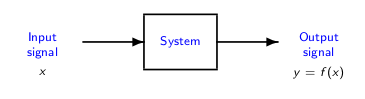

Mathematically, these systems are modeled as mapping of signals

We will presume an idealizing perspective:linear time-invariant (LTI) systems

Interpreting current and voltage as signals, electrical circuits consisting of a
resistor (R), an inductor (L), and a capacitor (C) are LTI systems.

**Current and voltage as signals in RLC circuits**

Consider an RLC circuit with ideal components connected in series:

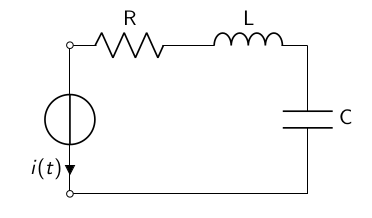

Characteristic of electric circuits: interchange between magnetic and electric
field

,periodic signals of current and voltage,LTI system

**Transient function of current in RLC circuits**

Consider the following RLC circuit:

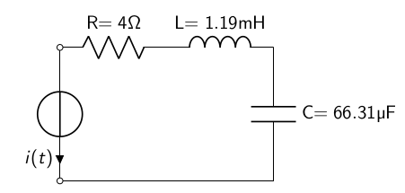

Given a sinusoidal excitation of the voltage source,

uin (t) = ûin · cos(ωt + φ) = 100V · cos(2π · 50Hz · t),

derive the transient function i(t) of current.

**Transient function of current in RLC circuits**

The solution in this example is closely linked to the ”transfer function“
between input x and output y signal in LTI systems.

This “transfer function“ is a frequency based measurement function,the frequency
response function.

It expresses the frequency domain relationship between x and y .

It enables the identification of the resonant frequencies, dampening and mode
shapes of a signal.

Basic mathematical methodology: Fourier analysis.

**periodic rectangular pulse**

The cosine functions establish a system for the approximation of x(t).

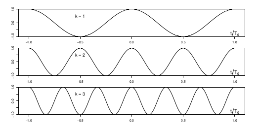

**periodic rectangular pulse**

**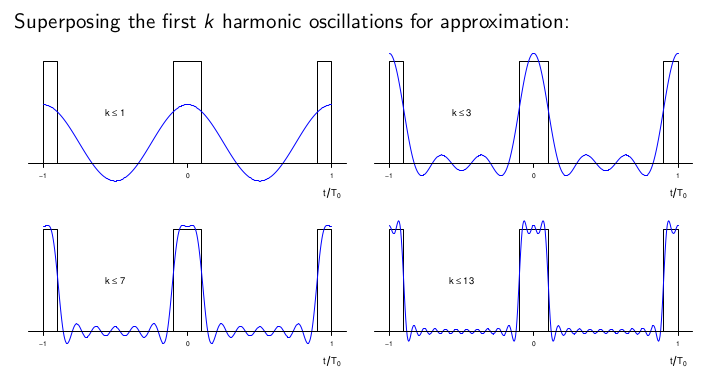**

**Amplitude spectrum and power spectrum**

interpretation of complex form Fourier coefficients:

c−k (ck ): oscillation amplitude at negative (positive) frequency

squares of c0 , c−k , ck : shares of signal power falling into respective
frequency bins

**amplitude spectrum**: the display of amplitudes as a function of frequency

**power spectrum:** the display of the distribution of power

Both are line spectra with equidistant lines at intervals of f0 (the signal
frequency).

**amplitude spectrum**

amplitudes for given frequencies ±k · f0 (with f0 = 1/T0 )

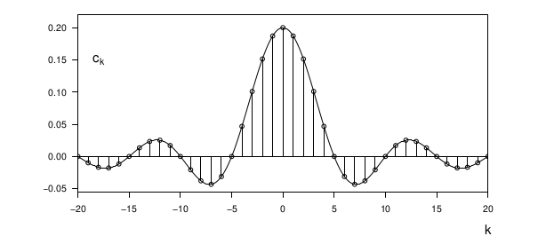

\\

**power spectrum**

**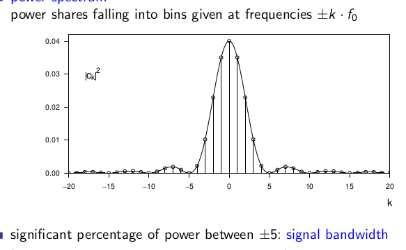**

**Output response to a periodic input signal**

Fourier analysis facilitates the study of output signals y responding to
periodic input signals x in LTI systems, namely via decomposition by oscillation
components.

Requisites: harmonic oscillations are eigenfunctions of any LTI system principle
of superposition

Approaches from a physical perspective lead to similar conclusions, e.g., about
the response to periodic voltage and current sources in RLC networks.

The method of Thévenin equivalent circuit provides a setup of oscillation
equivalent voltage sources.The principles of electrical engineering apply to the
derivation

of output response and further characteristics.

an RC circuit and the response to a rectangular pulse

A periodic bitstream is modeled as rectangular voltage pulse.

(e.g., 100001000010000. . . , a clock pulse with T /T0 = 1/5)

Suppose, the transmission path, a two-wire line, can be described by an R/C
voltage divider.

Then, what is the voltage response at the capacitor?

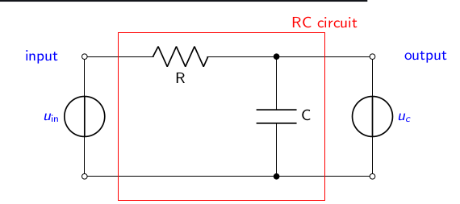

**信号及其类型**

Information represented by a signal is carried by matter or energy.

Physical signals are modeled as real or complex mathematical functions in time
and/or space domain.

Signals can be: discrete-time or continuous-time; digital or analog; periodic or
aperiodic; deterministic or stochastic; energy signals or power signals.

**Amplitude spectrum, power spectrum 概念**

**amplitude spectrum**: the display of amplitudes as a function of frequency.

**power spectrum**: the display of the distribution of power.

**Measure the system’s frequency response**

Magnitude: a measure of amplitude amplication or dampenin \|H(jω)\| as
particular measure of dampening: db

Phase shift: a measure of delay.

**四种理想的filter举例及意义**

Low pass; high pass; band-pass; band-stop.

举例: Butterworth filter, Chebyshev filter, Cauer filter, etc.

**Impulse 定义**

A very brief input signal of very high energy.

**Time-continuous transmission systems 的四个特征**

**Linearity**: A transmission system is linear if the relationship between the
input

and the output signal is a linear map.

**Time invariance**: A transmission system is time-invariant if for the output
signal y (t)

which is due to the input signal x(t), it holds that y (t − t0 ) is the

output signal due to the input signal x(t − t0 ) for any turn-on

instant t0.

**causality**: A transmission system is causal if the impulse response of the

system uses only the present and past values of the input signal to

determine the output signal.

**BIBO-stability**: BIBO = bounded-input, bounded-output.

**Turn the message into the singal(transmitter的To-do list)**

Source coding: to drive a transmission-suited signal.

Channel coding: to protect the message from transmission errors.

Modulation: to make the singal transmission-line-suited.

**Transmitter两个crucial questions**

How to derive a transmission-suited signal from an analog message: Signal
digitalization.

How to protect it from transmission errors?: Signal processing by digital
filters.

**Baseband signal (lowpass signal):** is a signal that can include frequencies
that are close to zero.

**Signal-to-noise ratio (SNR):**

**Pulse code modulation(PCM):**

Standard form of audio sampling.

The amplitude is sampled at set intervals and stored as a digital value using
the sample’s bit depth.

Specific type: Linear pulse code modulation (LPCM); Quantization levels are
linearly uniform.

**Ascii-Code:** Seven binary digits for the representation of 128 characters,
messages and commands, plus optional parity bit for error detection.

**Transmission timing**:

asynchronous: start-stop-method (e.g. RS-232 interface), only for short
transmission frames.

synchronous: clock pulse generation in the transmitter, which is made available
to the receiver.

**Concepts of digital baseband transmission**:

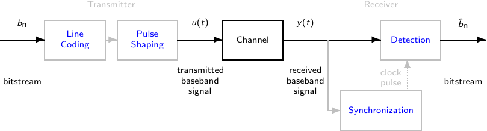

**Baseband transmission requirements**:

An ideal binary source emits a clock pulse stream of iid (uniformly distributed
independent) binary digits bn ∈ {0, 1}.

The transmitter adjusts the binary signal to the physical channel
characteristics. General requirements:

DC free (to avoid distortion when transmitter/receiver are not coupled); high
spectral efficiency (to achieve high bit rates with limited bandwidth); high
clock frequency (for easy synchronization); less susceptible to interference (to
make detection efficient); suited for less complex ransmitters/receivers (saves
energy and money).

**Transmitter**:

(1) Line coding produces a pattern of voltage (or: current, photons) to
represent the binary signal.

Beforehand, a “scrambler” (a logic circuit) can be used for bijective mapping
into a bitstream which meets the iid requirement.

(2) Pulse shaping:

Each bit is mapped to a rectangular transmission pulse: The resulting baseband
signal is a linear combination of rectangular pulses, weighted and translated
across time.

To minimise intersymbol interference (ISI), a raised cosine filter (similar to
sinc) can be used.

Tolerance ranges are specified by pulse masks (related to pulse height and bit
rate, bit duration respectively).

**Receiver**:

(1) Synchronization:

Recovery of the clock pulse, i.e. of the time slot for the rectangular pulse.

(2) Sampling:

Given ideal synchronization, the received baseband signal y(t) is sampled at the
rectangular pulse’s midpoint.

(3) Detection:

Binary digit 1 (or 0) is attributed to the sample y [n] when passing threshold
value 0.

An optional “descrambler” reverses the transmitter’s “scrambling” if necessary.

The eye pattern provided by an oscilloscope display can be used for the
evaluation of the combined effects of channel noise, dispersion and intersymbol
interference.

**Carrier modulation (and demodulation)**

In many cases (e.g. radio frequency channels) only a certain passband of
frequencies is admissable for signal transmission.

How can we then transmit a message signal whose frequency spectrum does not fall
within that admissable range?

We can alter properties of a transmittable signal according to the message
signal we wish to send.

This process is called carrier modulation.

The transmittable signal is our carrier signal, a waveform (usually sinusoidal)
which is modulated by the message signal.

Carrier-modulated transmission (passband transmission) allows communication over
a bandpass filtered channel.

At the receiver, the message signal is extracted from the modulated carrier by
demodulation.

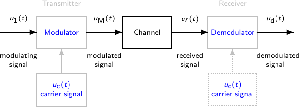

The carrier signal usually has a much higher frequency than the message signal.

This is because it is impractical to transmit signals with low frequencies.

Another purpose of carrier modulation: to transmit multiple carrier waves at a
time through a single shared communication medium, using frequency division
multiplexing (FDM).

**Carrier modulation (and demodulation)的Examples**

Analog bandpass modulation: the analog carrier is modulated by an analog signal:

amplitude modulation (AM); frequency modulation (FM); phase modulation (PM)

Digital bandpass modulation: the analog carrier is modulated by a digital
signal:

amplitude-shift keying (ASK);frequency-shift keying (FSK); quadrature amplitude
modulation (QAM)

**Devices for FM demodulation**

Conventional FM receiver (“modulation converter”)

(1) Amplitude fluctuation clipping and bandpass filtering of the modulated
signal.

(2) A differentiator differentiates the modulated signal to retrieve the
instantaneous angular frequency in terms of amplitudes.

(3) Envelope detector.

FM receiver with phase-locked loop

Sets up a reference signal to compare its phase with that of the modulated
signal in a synchronization process:

(1) Phase discriminator and loop filter to produce a smoothed phase difference
signal.

(2) Voltage-controlled oscillator (VCO) (adapted to the carrier’s angular
frequency) to tune the reference voltage in to the modulated signal’s
instantaneous frequency.

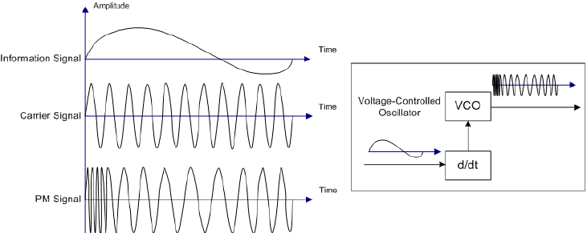

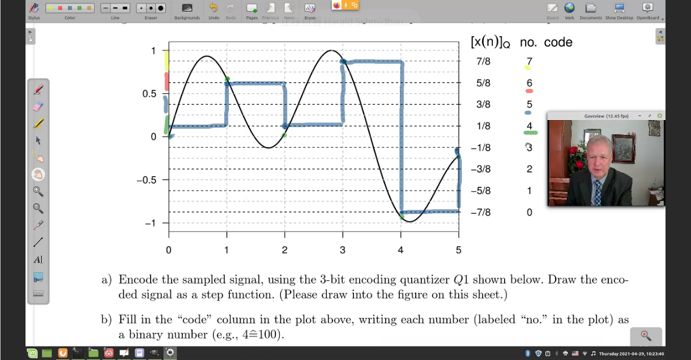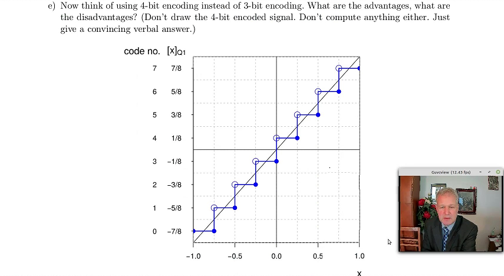

1.  Encode the sampled signal, using the 3-bit encoding quantizer Q1 shown
    below. Draw the enco-ded signal as a step function.

2.  Fill in the code column in the plot above, writing each number (labeled no.
    in the plot) as a binary number (e.g., 4=100).

**竖着写： no：7 6 5 4 3 2 1 0**

**Code：111 110 101 100 011 010 001 000**

c) Write the entire code stream of the sampled and quantized signal, using
binary number representations.

**Bit stream 100 110 100 111 000 011**

d) What does it mean when we say that quantizing a signal creates noise? Give an
example from(a) above. (You may show this in the plot.)

**Quantizing with this quantizer creates noise. We see this at epochs t=0 and
t=2.in both cases, the original signal(×(0),×(2)) is equal (a very close) to 0,
while the quantized value is further away from 0. [quantitative equivalent to
use a limited subject is 8 quantitative values to represent the actual sampling
value, the value of each sampling point and quantitative values, there is a
difference between between quantization error, the source of the error is in
fact quite so when the sampling value falls on quantization step curve
corresponding to the quantization interval, his whole sampling values are in the
range with the same quantitative value Therefore, it is bound to have errors.]**

e) Now think of using 4-bit encoding instead of 3- bit encoding. What are the
advantages, what are the disadvantages?

**Using 4-bit encoding instead of 3-bit encoding:—advantage：errors will become
smaller, less noise will he created, better SNR（improved ca 6dB）**

**—disadvantage：longer bit sequence required to represent the signal（4 bits
instead of 3 bits for each sampled point） The advantage of using four-bit
binary encoding is that there are 2\^4=16 quantization partitions in total,
which is twice as many as the three-bit binary (2\^3=8). Each quantization
interval is 1/2 of the previous one, and the corresponding quantization error is
also smaller. However, the coding bits of each sampling value are more than one
bit, and the transmission amount during communication increases to 4/3 of the
original, and the pressure on communication transmission increases.**

2\. Assume a message source X, generating a discrete-time integer signal which
can values ranging from -100 through +100.

1.  Determine the minimum number of bits necessary for loss less encoding of
    this signal’s domain (=range=supports).

**The alphabet of X has 201 symbols. Therefore:log2(201)=7.651 [bit] So, at
least an 8-bit encoding is needed.**

1.  Determine and interpret the efficiency of your encoding in(a) if all value
    in the signal’s domain are equally probable.

**Information entropy, H(X)=log2(201)=7.651 Average code length, 8[hit]→code
efficiency: η=7.651/8=0.956=95.6%**

**Interpretation it is close to 100%, but not equal to 100%. This is because
8-bit encoding provides for an alphabet of length 256, while we need only 201
symbols.**

1.  Now assume that value 0 has probability 0.5, while all others values are
    equally probably. Determine the distribution. Determine the redundancy
    generated by X.

**Distribution of X:**

**Value -100 ……… -1 0 +1 ……… +100**

**Probability 1/400 ……… 1/400 0.5 1/400 ……… 1/400**

**Hmax = log2(201)=7.651[bit]**

**H(x)= -0.5log2(0.5)-log2(1/400)=-0.5[log2(0.5)+log2(1/400)] =4.822**

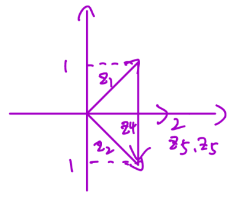**Redundancy=Hmax-H(X)=7.651-4.822=2.829**

3\. 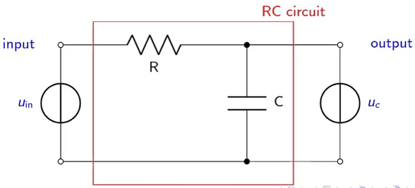

(1) Given is an RC circuit. (2)The circuit is excited with a DTMF signal, e.g."
1"(697/1209Hz) This is defines the input, Uin(t)

(3) What does the signal look like? What is its Fourier transform? 2
frequencies；each of them：**sin(2∏ft), 2∏f=w. f1=697—x1(t)=sin(2∏f1t).
f2=1209—x2(t)=sin(2∏f2t)**

**Xt=x(t)=Uin(t)=x1(t)+x2(t)**

(4)How does the system(the RC circuit) react to this input(lowpass filter)

**H(jw)=1/1+jwT=1/1+j2∏f T，T=R•C**

**f1=697—y(jw1)=H(jw1)X(jw1). f2=1207—y(jw2)=H(jw2)X(jw2)**

(5) We'll now see two scenanes. **S1: T=1/2•∏•697.(large) For x1: ∏=2∏•697•T=1.
For x2:∏=2∏•1209•T=1.78  S2: T=1/2•∏•1209.(small) For x1: ∏=2∏•697•T=0.58. For
x2:∏=2∏•1209•T=1**

(6) T large—system is sluggish; T small-precise,quick. so,t=RC the less the
better

4.Given are the numbers Z1=1+j, Z2=1-j. Here, j is imaginary unit.

a) Compute Z3=Z1+z2, z4=z1-z2, z5=z1\*z2

**z3=z1+z2=2, z4=z1-z2=2j,  z5=z1\*z2=2**

b) compute z3=z1+z2;z4=z1-z2;z5=z1·z 2**如图**

c) **arctanZ1=arctan(b/a)=arctan(1)=45度+k派arctanZ2=arctan(-1)=-45度+k派;**

**arctanZ3=arctan(0/2)=0+k派; arctanZ4=arctan(2j/0)=派/2+k派 （k属于z)**

3\. Given is a rectangular pulse as follows:

x(t)= 1 for -0.5≤t≤+0.5， 0 otherwise

a) Sketch x(t)

b) Compute the Fourier transform of x(t).

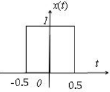
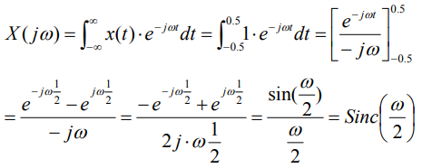

c) Determine the first positive zero of the Fourier Transform, that is, the
smallest w＞0 with X(jw)=0 **ω=2∏**

d) Sketch the amplitude spectrum of x(t)

**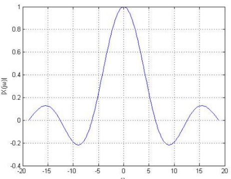**

4\. It is often assumed that an RLC circuit is an LTI system.

a) What does LTI mean in this context? Explain by describing typical input and
output of the system. **Is the outgoing signal number of system, then the input
is the outgoing signal number when the and signal number Uin (t)= U1 (t)+ U2
(t). i (t)= i1 (t)+ i2 (t), where i1 (t) and i2 (t) are U1 (t) and U2 (t)
operating on the system respectively. The output of the system; In addition,
when the input Uin (t) is delayed for some time and becomes Uin (t-t0) acting on
the system alone.The output of the system will be similarly delayed to i
(t-t0).**

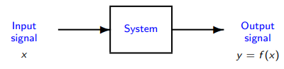

b) The system is excitated with a sinusoidal voltage wave. What does this imply
for the current in this system? **RLC series circuit is a harmonic circuit. When
the damping coefficient α=R/2L\< ω0 =1/ √LC, the circuit is in the state of
undamped or underdamped. Under the excitation of sinusoidal voltage, the current
in the system will present two frequency components, one is the same as the
input sinusoidal signal frequency, the other is the same as the resonance
frequency of the circuit. When the damping coefficient α=R/2L≥ω0=1/ √LC, the
circuit is in the state of transient damping or overdamping, and the system only
has the same response as the input sinusoidal signal frequency under the
excitation of sinusoidal voltage.**

c) Is it possible to see an output (current) frequency which is not contained in
the input (voltage) signal? Discuss briefly and give reasons for your answer.

**Perhaps, when the damping coefficient α=R/2L\< ω0 =1/ √LC, the circuit is in
the undamped or underresistance Ni-state, even if there is no component of
frequencyω0=1/ √LC in the system excitation signal, the current in the system is
still The same component occurs at the circuit resonant frequency ω0=1/√LC .**

5\. What is Amplitude Modulation? For what purpose is it needed? Please give
examples. You may support your answer with a plot.

**Amplitude modulation, also known as medium wave, ranges from 530 to 1600 kHz.
Amplitude modulation is an electrical signal in which the sound level is changed
into amplitude.**

**The purpose is for transmission, low frequency signal transmission distance is
close, in order to transmit far, you have to improve the signal frequency, and
amplitude modulation is to carry out spectrum shift, from low frequency to high
frequency, to facilitate long-distance transmission.**

**AM technology is much simpler than FM and digital broadcasting technology.An
AM broadcast receiver only needs to detect changes in the voltage amplitude of a
particular frequency signal, an action called detection, and then amplify the
voltage changes to drive the speaker.**
