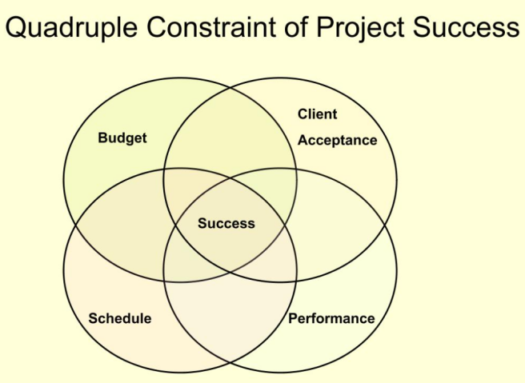
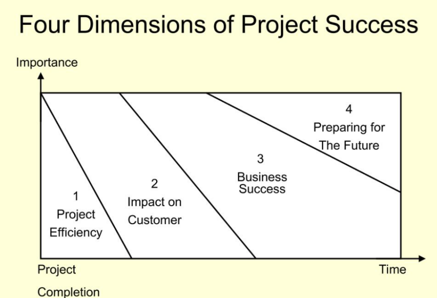
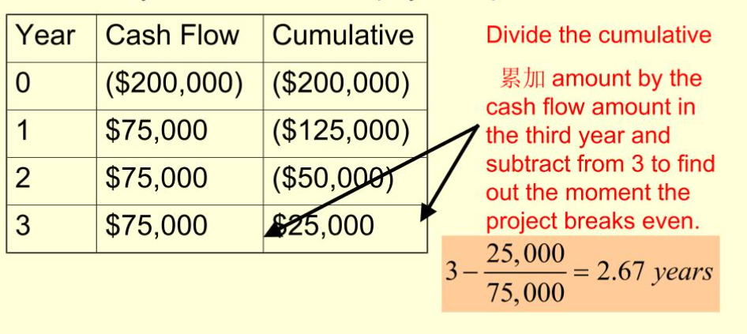
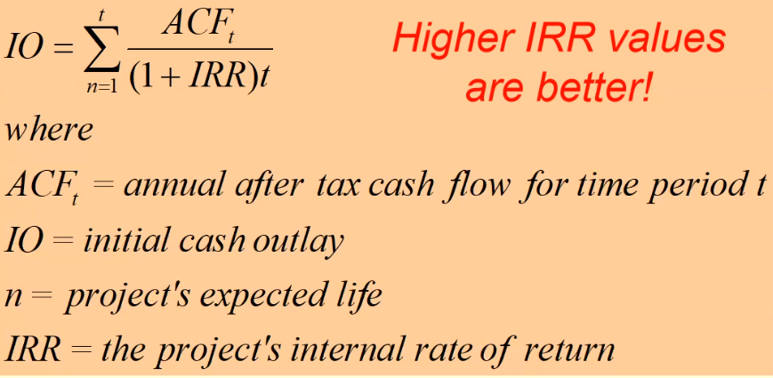

**Project和Process的区别**

A project is a temporary endeavor undertaken to create a unique product or
service.

项目不是一个重复的任务,是商业增值的基础。

**Project:**

Take place outside the process world

Unique and separate from normal organization work

Continually evolving (每次工作都有创新性)

**Process:**

Ongoing, day-to-day activities

Use existing systems, properties and capabilities

Typically repetitive (都是循规蹈矩)

**Definition of Project**

是面向目标的,每个项目必须要有一个明确的目标,必须要由一些相互关联的活动来组织协调,在一个有限的时间范围之内完成的项目活动

**Element of project**

**Complex**, one-time process

**Limited** by budget, schedule and resources

Developed to resolve a **clear goal** or set of goals

**Customer-focused**

**General Project Characteristics**

**Ad-hoc** endeavors with a clear life cycle 有一个清晰的生命周期

**Building blocks** in the design and execution of organization
**strategies**有清晰的组织策略

Responsible for the **newest** and most improved **products**, services and
**organizational** process 一个新的工作才是一个project

Provide a philosophy and strategy for the **management of
change**提供一个非常清晰的策略

Entail **crossing** function and organization **boundaries**
需要跨功能跨组织的边界

**Traditional management functions** of planning, organizing, motivating,
directing and controlling apply传统的管理功能是…

Principla outcomes are the **satisfaction of customer** requirement within
**technical, cost** and **schedule constraints**要顾客满意, 要有质量和进度约束

**Terminated** upon successful completion项目结束都是有个成功标志

**Process & Project management**

**Process：**

1.  repeat process or product.

2.  Serval objectives

3.  Ongoing

4.  People are homogeneous

5.  Systems in place to integrate efforts

6.  Performance cost & time known

7.  Part of the line organization

8.  Bastions of established practice

9.  Supports status quo

**Project**:

1.  New process of product

2.  One objective

3.  One shot-limited life

4.  More heterogeneous

5.  Systems must be created to integrate efforts

6.  Performance cost \&time less certain

7.  Outside of line organization

8.  Violates established practice

9.  Upsets status quo

**Why are project Important?**

1.  shorten product lifecycles缩短产品周期

2.  narrow product launch windows让产品发布更快

3.  increasingly complex and technical products增加产品复杂度

4.  emergence of global markets占领全球市场

5.  economic period marked by low inflation以低通货膨胀率来标识生命周期

**项目四阶段**

1.  conceptualization: the development of the initial goal and technical
    specification提出技术指标和可行性

2.  planning – all detailed specifications schedules schematics and plans are
    developed工期和计划得做出来

3.  execution – the actual ”work” of the project is performed真正干活

4.  termination – project is transferred to the customer, resources reassigned
    project is closed out. 把项目完成, 解散项目组成员, 资源回归, 存档

**Quadruple Constraint of Project Success**

**6 Criteria for IT Project success**

1.  System quality

2.  Information quality

3.  Use

4.  User satisfaction

5.  Individual impact

6.  Organization impact

**4 Dimensions of Project Success**

**Developing Project Management Maturity Generic Model**

**High Maturity**: Institutionalized, seek continuous improvement

**Moderate Maturity**: Defined practices, training programs, organization
support

**Low Maturity**: Ad hoc process, no common language, little support

**Chapter 2**:the organizational Context

**Projects and Organizational Strategy**

**Strategic management**: The science of formulating, implementing and
evaluating **cross functional decisions** that enable an **organization** to
achieve its objectives.

**Consists of**: Developing vision and mission statements; Formulating,
implementing and evaluating; Making cross functional decisions; Achieve its
objects

**Projects and Organizational Strategy**

Projects are **stepping stones** of corporate strategy.

The firm’s strategic development is a **driving force** behind project
development.

**Stakeholder Management**

Stakeholders are **all individuals or groups** who have an **active stake** in
the project and can potentially impact, either **positively or negatively**, its
developments

**Internal Stakeholders**: Top management, account, other functional managers,
project team members

**External Stakeholders**: Clients, Competitors, suppliers, Environmental,
political, consumer and other intervenor groups

**Organizational Structure**

**Designates forming reporting relations**: number of levels in the hierarchy;
span of control

**Groupings of**: individuals into departments; departments into the total
organization

**Design of systems for**: effective communication, coordination, integration
across departments

**Forms of organizational Structure**

Functional organizations: group people performing similar activities into
**departments**

Project organizations: group people into **project teams** on the temporary
assignments

Matrix organizations: create a dual hierarchy in which **functions and
projects** have equal prominence

**Functional Structures for Project Management**

**Strengths:** Form’s design maintained; fosters development of in-depth
knowledge; Standard career paths; Project team members remain connected with
their functional group.

**Weakness:** functional soiling; lack of customer focus; projects may take
longer; projects may be suboptimized.

**Project Organization**

优Project manager sole authority; improved communication; effective
decision-making; creation of project management experts; rapid response.

劣Expensive to set up and maintain teams; change of loyalty to the project
rather than the firm; no pool of specific knowledge; workers unassigned at
project end.

**Matrix Structures**

优Suited to dynamic environments; equal emphasis on project management and
functional efficiency; promotes coordination across functional units; maximizes
scare resources

劣Dual hierarchies mean tow bosses; negotiation required in order to share
resources; workers caught between competing project & functional demands

**Heavyweight Project Organizations**

Organizations can sometimes gain tremendous benefit from creating a
**fully-dedicated project organization**

**Project Management Offices**

Centralized unit that oversee or improve the management of projects.

**Resource center for**: Technical details offloaded from manager; expertise in
project management skills; repository of lessons learned, documentation; center
for project management excellence.

**Forms**: weather station(监控和溯源); control tower(项目管理保护提供支持);
resource pool(职能和人才).

**Organizational Culture**

The **unwritten rules** of behavior, or norms are used to **shape and guide
behavior**, is shared by **some subset of organization** members and is
**thought to all new members** of the company.

**Culture affects project management**

Departmental interaction; employee commitment to goals; project planning;
performance evaluation.

**Chapter 3**

**Project Selection**

Screening Models are numeric or nonnumeric. Should have: realism, capability,
flexibility, easy of use, cost effectiveness, comparability

**Screening & Selection Issues**

Risk - unpredictability to the firm

Commercial - market potential

Internal operating - changes in firm operations

**Approaches to Project Screening**

**Checklist model**: a list of criteria applied to possible projects. Requires
agreement on *criteria*. Assumes all criteria are *equally important*. *Valuable
for recording opinions and encouraging discussion.*

**Simplified Scoring Modeling**: Each project receives a score that is the
weighted sum of its grade on a list of criteria. Scoring models requires:
agreement on *criteria*, agreement on *weights* for criteria, a *score* assigned
for each criteria.

**Analytic Hierarchy Process**

1.  Construct a hierarchy of **criteria and subcriteria**

2.  **Allocate weights** to criteria

3.  Assign **numerical values** to evaluation dimensions

4.  **Scores determined** by summing the products of numeric evaluations and
    weights

Unlike the simple scoring model, these scores can be compared

**Financial Model**

Based on the time value of money principal.

Payback period, net present values(净值), internal rate of return, options
models. *All of these models use discounted cash flows*

**Payback Period**

第2和3年出现转折, 那么就算第三年的数据

**Net Present Value**

Projects the change in the form’s stock value if a project is undertaken.

**

**Internal Rate of Return**

A project must meet a **minimum rate of return** before it is worthy of
consideration.
