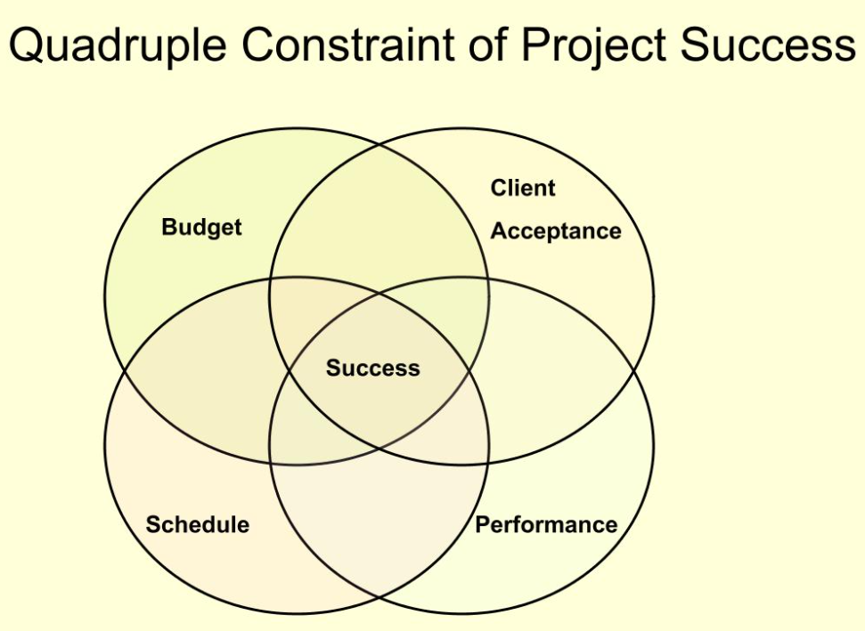
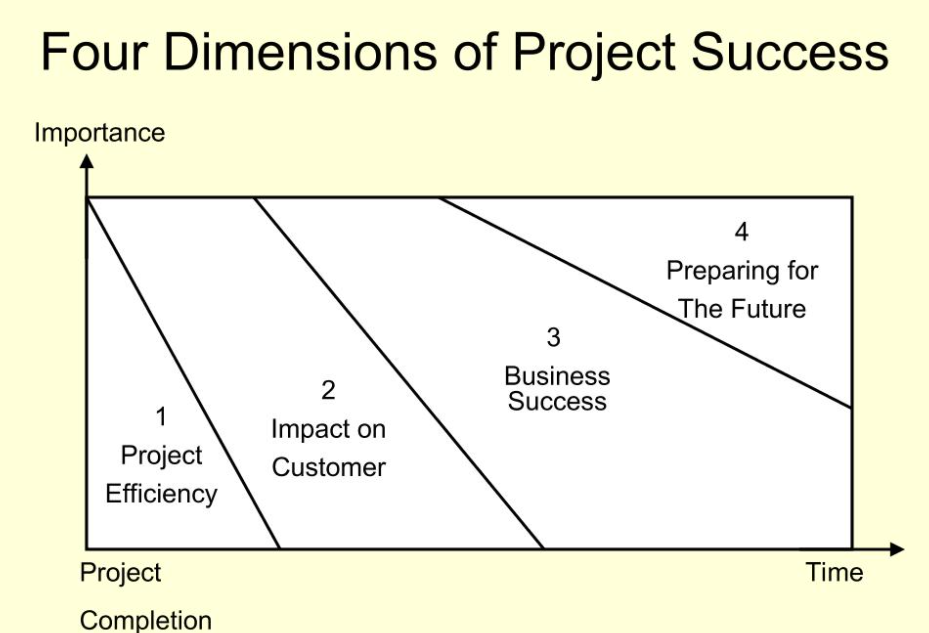

**Project和Process的区别**

A project is a temporary endeavor undertaken to create a unique product or
service.

项目不是一个重复的任务,是商业增值的基础。

**Project:**

Take place outside the process world

Unique and separate from normal organization work

Continually evolving (每次工作都有创新性)

**Process:**

Ongoing, day-to-day activities

Use existing systems, properties and capabilities

Typically repetitive (都是循规蹈矩)

**Definition of Project**

是面向目标的,每个项目必须要有一个明确的目标,必须要由一些相互关联的活动来组织协调,在一个有限的时间范围之内完成的项目活动

**Element of project**

**Complex**, one-time process

**Limited** by budget, schedule and resources

Developed to resolve a **clear goal** or set of goals

**Customer-focused**

**General Project Characteristics**

**Ad-hoc** endeavors with a clear life cycle 有一个清晰的生命周期

**Building blocks** in the design and execution of organization
**strategies**有清晰的组织策略

Responsible for the **newest** and most improved **products**, services and
**organizational** process 一个新的工作才是一个project

Provide a philosophy and strategy for the **management of
change**提供一个非常清晰的策略

Entail **crossing** function and organization **boundaries**
需要跨功能跨组织的边界

**Traditional management functions** of planning, organizing, motivating,
directing and controlling apply传统的管理功能是…

Principla outcomes are the **satisfaction of customer** requirement within
**technical, cost** and **schedule constraints**要顾客满意, 要有质量和进度约束

**Terminated** upon successful completion项目结束都是有个成功标志

**Process & Project management**

**Process：**

1.  repeat process or product.

2.  Serval objectives

3.  Ongoing

4.  People are homogeneous

5.  Systems in place to integrate efforts

6.  Performance cost & time known

7.  Part of the line organization

8.  Bastions of established practice

9.  Supports status quo

**Project**:

1.  New process of product

2.  One objective

3.  One shot-limited life

4.  More heterogeneous

5.  Systems must be created to integrate efforts

6.  Performance cost \&time less certain

7.  Outside of line organization

8.  Violates established practice

9.  Upsets status quo

**Why are project Important?**

1.  shorten product lifecycles缩短产品周期

2.  narrow product launch windows让产品发布更快

3.  increasingly complex and technical products增加产品复杂度

4.  emergence of global markets占领全球市场

5.  economic period marked by low inflation以低通货膨胀率来标识生命周期

**项目四阶段**

1.  conceptualization: the development of the initial goal and technical
    specification提出技术指标和可行性

2.  planning – all detailed specifications schedules schematics and plans are
    developed工期和计划得做出来

3.  execution – the actual ”work” of the project is performed真正干活

4.  termination – project is transferred to the customer, resources reassigned
    project is closed out. 把项目完成, 解散项目组成员, 资源回归, 存档

**Quadruple Constraint of Project Success**

**6 Criteria for IT Project success**

1.  System quality

2.  Information quality

3.  Use

4.  User satisfaction

5.  Individual impact

6.  Organization impact

**4 Dimensions of Project Success**

**Developing Project Management Maturity Generic Model**

**High Maturity**: Institutionalized, seek continuous improvement

**Moderate Maturity**: Defined practices, training programs, organization
support

**Low Maturity**: Ad hoc process, no common language, little support

**D**
