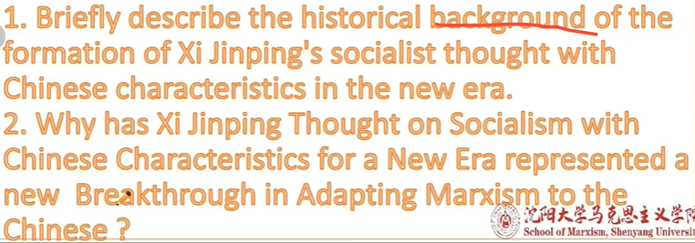
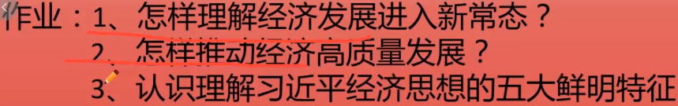
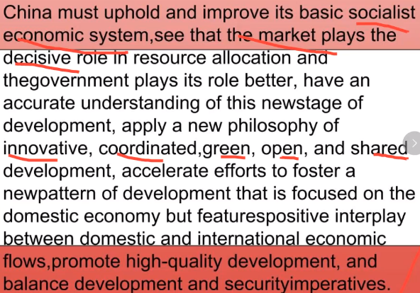
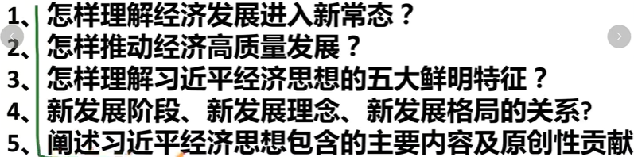
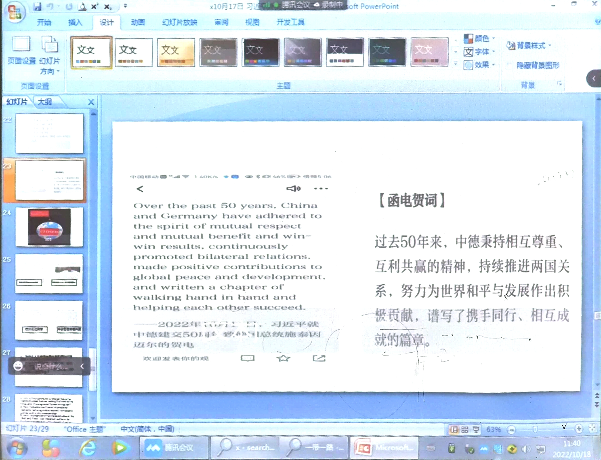
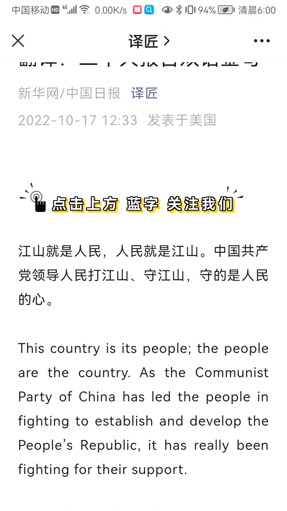

# 0830
=========

[**直播间信息(点我刷回放):XZTB6784**](https://zhibo.chaoxing.com/3000173437939264?tm=1661824852090)

作业：
1. 习近平新时代中国特色社会主义的内涵？（双语）
“This is the Marxism of contemporary China and of the 21st century. It embodies
the best of the Chinese culture and ethos in our times and represents a new
breakthrough in adapting Marxism to the Chinese context.”
2.  习近平新时代中国特色社会主义的思想主题是什么？（双语）
What kind of socialism with Chinese characteristics we should uphold and develop in this new era, what kind of great modern socialist country we should build, and what kind of Marxist 
party exercising long-term governance we should develop, as well as how we 
should go about achieving these tasks.
3. 马克思主义中国化和中国化马克思主义：马克思主义中国化是一个过程，而中国化马克思主义是结果。

# 0906
=========

[**直播间信息(点我刷回放)：CMSY7417**](https://zhibo.chaoxing.com/3000176462504681?tm=1662430005267)

答案（From PPT）**(只需要抄英文)**：

1. The world is undergoing momentous changes unseen in a century, China is in a
critical period from rich to strong.
2. The Mechanism of Ideological Formation Has New Connotations; New Development
Occurs in the Ideological Themes; The Core Content is even richer; The Formation
of Independent Theoretical Forms; The Theoretical Orientation Has a New Height

[英译中，只用写中文(习近平致北京师范大学“名师计划”学生的信全文):](https://article.xuexi.cn/articles/index.html?art_id=14178005118158187083&item_id=14178005118158187083&study_style_id=feeds_default&pid=67698637881095097&ptype=75&source=share&share_to=wx_single)
（离线原文：）
Full text of Xi Jinping's Letter to Students of Beijing Normal University
Attending "Outstanding Teachers Program"
Dear students,
I have received your letter. Over the past year since you were enrolled in the
program, through course study and offering teaching service in underdeveloped
regions, you have enriched your knowledge, broadened your horizon and hardened
the conviction of going down to serve at the grassroots. I am very glad to learn
that. As Beijing Normal University celebrates its 120th anniversary, I would
like to extend my warm congratulations and best wishes to all faculty members,
students and alumni!
Beijing Normal University, as the earliest modern teacher-training institution
of higher learning in China, has cultivated a great number of outstanding
teachers for the country. I hope that you will carry forward the university's
motto "Learn, so as to instruct others; act, to serve as example to all," waste
no time and study hard, cultivate your moral character and improve your
capabilities of teaching students both knowledge and the way of leading a
rewarding life. I also hope that you will serve in places where the country and
people need you the most, and work hard to become a qualified teacher with firm
ideals and beliefs, moral sentiments, solid knowledge and benevolence so as to
commit yourselves to nurturing a new generation of capable young people with
moral grounding, intellectual ability, physical vigor, aesthetic sensibility and
work skills for the socialist cause.
Upon the arrival of Teachers' Day, I would like to wish all teachers across the
country a happy festival!
Xi Jinping
September 7, 2022

# 0913
=========

[**直播间信息(点我刷回放)：TTNJ6833**](https://zhibo.chaoxing.com/3000181755186053?tm=1663899343916)

答案(from ppt) **(只需要抄英文)**:
1. To deeply understand the scientific connotation of the new normal of economic
development. The new normal is an accurate judgment of China's economic
development trend. Under the new normal, China's long-term positive trend of
economic development has not been changed.
2. Take supply-side reform as the main line. Supply-side structural reform is
different from the supply-side one. The way of supply-side structural reform is
to increase effective supply.
3. 
> 1. Starting from the main contradiction in society and coordinating needs and needs, Xi Jinping's economic thought focuses on "beauty" and builds an economics that seeks happiness for the people. 
> 2. Starting from the labor theory of value and coordinating the dual connotations of economics and philosophy on value, Xi Jinping's economic thought focuses on "reality" and builds an economics that lays a stronger material foundation for national rejuvenation. 
> 3. Starting from economic laws and development reality, and coordinating the government and the market, Xi Jinping's economic thought focuses on "efficiency" and builds socialist market economics in the new era. 
> 4. Starting from a new stage of development, to coordinate the economy, society, material spirit, people and nature, Xi Jinping's economic thought focuses on "association", and builds an economics that will bring peace to all generations. 
> 5. Starting from the essence of socialism and coordinating efficiency and fairness, Xi Jinping's economic thought focuses on "community", and builds an economics of common prosperity and harmony in the world.

英译汉：

China must uphold and improve its basic socialist economic system, see that the market plays the decisive role in resource allocation and the government plays its role better, have an accurate understanding of this new stage of development, apply a new philosophy of innovative, coordinated, green, open, and shared development, accelerate efforts to foster a new pattern of development that is focused on the domestic economy but features positive interplay between domestic and international economic flows, promote high-quality development, and balance development and security imperatives.
中国要坚持和完善社会主义基本经济制度，更好发挥市场在资源配置中的决定性作用，更好发挥政府作用，准确认识新的发展阶段，运用创新、协调、协调的新理念， 绿色发展、开放发展、共享发展，加快形成以国内经济为中心、国内外经济流动良性互动的发展新格局，推动高质量发展，平衡发展与安全。

# 0920
=====

[**直播间信息(点我刷回放)：FDKW6672**](https://zhibo.chaoxing.com/3000181755186053?tm=1663899343916)

答案(From PPT)**(只需要抄英文)**：
1. To deeply understand the scientific connotation of the new normal of economic
development. The new normal is an accurate judgment of China's economic
development trend. Under the new normal, China's long-term positive trend of
economic development has not been changed.
2. Take supply-side reform as the main line. Supply-side structural reform is
different from the supply-side one. The way of supply-side structural reform is
to increase effective supply.
3. 
> 1. Starting from the main contradiction in society and coordinating needs and needs, Xi Jinping's economic thought focuses on "beauty" and builds an economics that seeks happiness for the people. 
> 2. Starting from the labor theory of value and coordinating the dual connotations of economics and philosophy on value, Xi Jinping's economic thought focuses on "reality" and builds an economics that lays a stronger material foundation for national rejuvenation. 
> 3. Starting from economic laws and development reality, and coordinating the government and the market, Xi Jinping's economic thought focuses on "efficiency" and builds socialist market economics in the new era. 
> 4. Starting from a new stage of development, to coordinate the economy, society, material spirit, people and nature, Xi Jinping's economic thought focuses on "association", and builds an economics that will bring peace to all generations. 
> 5. Starting from the essence of socialism and coordinating efficiency and fairness, Xi Jinping's economic thought focuses on "community", and builds an economics of common prosperity and harmony in the world.
4. 
> Entering a new stage of development, implementing new development concepts, and building a new development pattern are determined by the theoretical logic, historical logic, and realistic logic of my country's economic and social development, and the three are closely related. Entering a new development stage clarifies the historical orientation of my country's development, implementing the new development concept clarifies the guiding principles of my country's modernization drive, and building a new development pattern clarifies the path choice for my country's economic modernization. Grasping the new development stage is the realistic basis for implementing the new development concept and building a new development pattern. Implementing the new development concept provides an action guide for grasping the new development stage and building a new development pattern. Building a new development pattern is to deal with the opportunities and challenges of the new development stage. , The strategic choice to implement the new development concept.
5. 
> 1. Strengthening the Party's overall leadership over the economy and work is the fundamental guarantee. 
> 2. Adhering to the people-centered development ideology is the fundamental position. 
> 3. Entering a new stage of development is a historical orientation. 
> 4. Adhering to the new development concept is the guiding ideology. 
> 5. Building a new development pattern is a path choice. 
> 6. Promoting high-quality development is a distinct theme. 
> 7. Adhering to the improvement of the basic socialist economic system is the foundation of the system. 
> 8. Adhering to the theme-oriented implementation of the national development strategy is a strategic measure. 
> 9. Adhere to innovation-driven is the first driving force. 
> 10. Vigorously developing the manufacturing industry and the real economy is the main focus. 
> 11. Unswervingly expanding opening up in an all-round way is an important magic weapon. 
> 12. Overall development and security are important guarantees. 
> 13. Adhere to the correct work strategy and method is the method.

这个表格抄一遍：

|    | 十九大报告重要术语译法  |    |
| --- | --- | --- |
|    | 中文 | 英文 |
| 1 | 习近平新时代中国特色社会主义思想 | Xi Jinping Thought on Socialism with Chinese Characteristics for a New Era |
| 2 | 党的基本路线  【例】牢牢坚持党的基本路线这个党和国家的生命线、人民的幸福线。 | the Party's basic line   We must remain fully committed to the Party's basic line as the source that keeps the Party and the country going and that brings happiness to the people. |
| 3 | 基本方略  【例】新时代坚持和发展中国特色社会主义的基本方略 | basic policy  the basic policy that underpins our endeavors to uphold and develop socialism with Chinese characteristics in the new era |
| 4 | 我国社会主要矛盾  【例】中国特色社会主义进入新时代，我国社会主要矛盾已经转化为人民日益增长的美好生活需要和不平衡不充分的发展之间的矛盾。 | principal contradiction facing Chinese society  As socialism with Chinese characteristics has entered a new era, the principal contradiction facing Chinese society has evolved. What we now face is the contradiction between unbalanced and inadequate development and the people's ever-growing needs for a better life.  |
| 5 | 不忘初心，牢记使命  【例】大会的主题是：不忘初心，牢记使命，高举中国特色社会主义伟大旗帜，决胜全面建成小康社会，夺取新时代中国特色社会主义伟大胜利，为实现中华民族伟大复兴的中国梦不懈奋斗。 | remain true to our original aspiration and keep our mission firmly in mind  The theme of the Congress is: Remain true to our original aspiration and keep our mission firmly in mind, hold high the banner of socialism with Chinese characteristics, secure a decisive victory in building a moderately prosperous society in all respects, strive for the great success of socialism with Chinese characteristics for a new era, and work tirelessly to realize the Chinese Dream of national rejuvenation. |

# 0927
=====

[**直播间信息(点我刷回放)：cqkp6292**](https://zhibo.chaoxing.com/1000184066142475?tm=1664243950505)

# 1004
=====

[**直播间信息(点我刷回放)：smuv5587**](https://zhibo.chaoxing.com/2000185648501821?tm=1664849216569)

# 1011  线下了!
=====

[**直播间信息(点我刷回放)：cmka2132**](https://zhibo.chaoxing.com/8000185702776031)
1. Briefly describe the three-fold logic of Xi Jinping's rule of law thought.
2. Briefly describe the 6 firsts of Xi Jinping's rule of law thought.
3.How to understand that "if the rule of law prospers, the nation will prosper, and if the rule of law is strong, the nation will be strong"?
答案:
1. The historical logic, the theory of logic, the logic of practice.
2. A goal of struggle, a road of development, a strategic task, a cultural foundation, a value guide, a greater banner. 
3. A country should rule the country according to law, not power over the law, to create a good legal environment, only the rule of law, the country can thrive.

# 1018
=====
翻译：

1. Over the past 50 years, China and Germany have adhered to the spirit of mutual respect and mutual benefit and win-win results, continuously promoted bilateral relations, made positive contributions to global peace and development, and written a chapter of walking hand in hand and helping each other succeed. 过去50年来，中德秉持相互尊重、互利共赢的精神，持续推进两国关系，努力为世界和平与发展作出积极贡献，谱写了携手同行、相互成就的篇章。
2. This country is its people, the people are the country. As the Communist Party of China has led the people in fighting to establish and develop the People’s Republic, it has really been fighting for their support. 江山就是人民，人民就是江山。中国共产党领导人民打江山、守江山，守的是人民的心。

